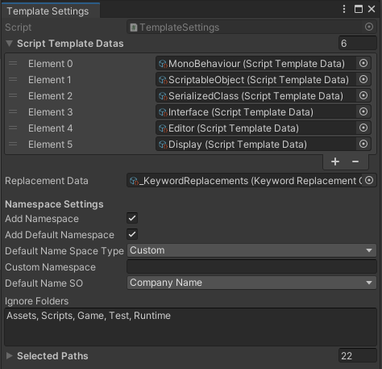
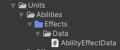
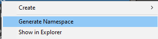

## ⚙️ AdvancedScriptTemplates for Unity

AdvancedScriptTemplates provides a flexible and efficient way to create new scripts using customizable templates directly within the Unity Editor.

---

### 🛠️ Settings & Customization

Settings can be accessed via:  
**Tools → AdvancedScriptTemplates → Settings**

From there, you can configure a wide range of options, including adding and modifying templates.



---

### ⌨️ Script Creation Shortcuts

Quickly create new scripts using keyboard shortcuts:  
**Ctrl + Alt + 1–6**

---

### 📄 Example Template: ScriptableObject

```csharp
using System.Collections;
using System.Collections.Generic;
using UnityEngine;

#NAMESPACE#
[CreateAssetMenu(menuName = "#SCRIPTABLE_OBJECT_NAME#/#PROJECT_NAME#/#SCRIPT_NAME#")]
public class #SCRIPT_NAME# : ScriptableObject
{
    
}
```

Templates support dynamic namespace generation based on the folder where the script is created.

---

### 🧭 Namespace Management

Folders can be marked with **Ctrl + N** to be excluded from namespace generation. Marked folders appear in blue.

Example:



```csharp
namespace Units.Abilities.Data
```

You can also regenerate namespaces if folders or files have been moved.  
When a folder is selected, all scripts within it and its subfolders will be updated.


